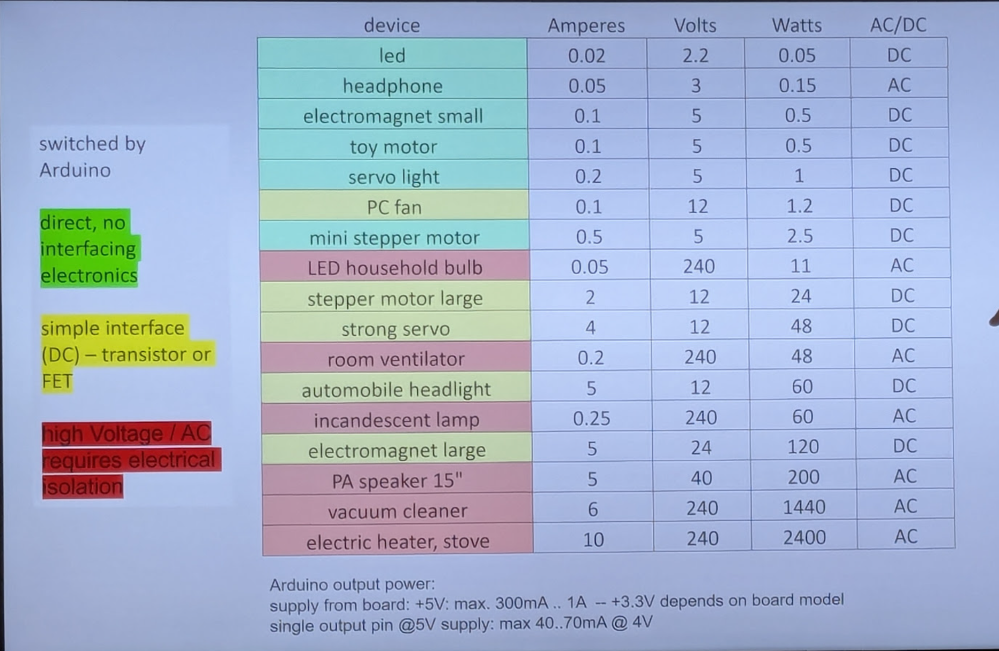

# Note

document in your code or a readme:

- your name
- idea/program function
- Changelog
- version number
- credits

# Perculiarities

- C is not great at performing multiple processes at once. In a game this can be quite problematic because the program needs to listen to the button and execute play logic at the same time. 

- How do you deal with the input signal? button is HIGH OR LOW, but a button may trigger multiple times (bouncing). Therefore you need to debounce the input.
- Analogue inputs. Is a variable value. You need to amplify and normalize the value between 1 and 0. 

# Powering hardware

if you want to use something bigger than an LED, like a motor, you have to think about the volts and amps needed

Electrical power (Watts) = Volts * current (ams)

# LED matrix

way to steer a grid of leds (or a screen) using very little wires.

# Pulse width modulation. 

Modify the brightness by changing the rate lights will turn on or off.

Logorithmic scale `analogueWrite(Val*val/265)`

# Electromagnets

If you have a core of iron an wind a coil around it you'd create a magnet, with a north an south pole. Can be used to 

## Relays

you can also move a switch using a magnet, this is a way to handle you not wanting to attach 240V to your laptop. These are called relays. These have also been the driving force of the first computing devices. Anything that can be plugged into a wall can be used through a relay.

You can operate stuff like this with it: Card door opener, windshield wiper motor, geared motor.

linear motor: used for motorized beds.

## Motors

if you want the direction of a motor you can swap the + and - pole. 

## Nitinol (muscle wire)

metalic structure that if you bend it in a specific shape and cool it down, then if it is cold and you pull it out if will bend out of shape, but if you heat it again it will go back into the previous shape. 

- get's hot. 
- responds well to heating, but it is difficult to cool down electrecly. That's done by the environment which is slow.

> **Phillip Beesley - Hylzoic Ground**
> here Nitinol was used

