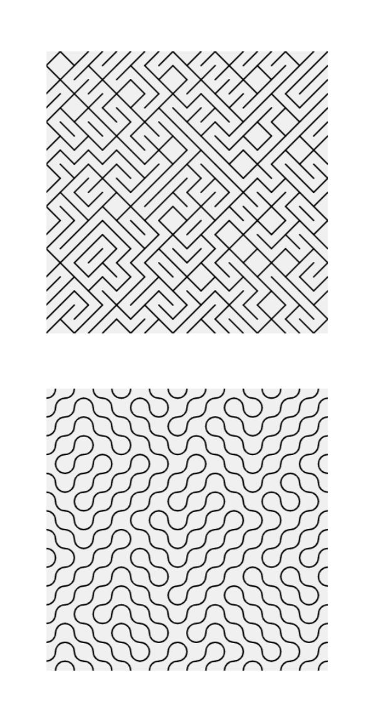

# Assignment 1: Grid Patterns

## 🚀 How to run
View the result by opening the `index.html` file in your browser.

## 🏛️ Disclaimer
Results may be inspired on the code of others. This was done not to copy but to get ideas for what is possible within the assignment. References to used information can be found in the code's comments.

## 📄 Instructions
Create a sketch that generates a different grid-based pattern each time it is run by using either the `random()` function or the `noise()` function, e.g., to choose the positions and types of shapes drawn. 
Marks will be awarded based on technical implementation and visual design. You may use colour and drawing styles, but this is not required.

The examples shown here are based on simple grids, like those you developed in the worksheet exercises, the top one is 20x20 and draws a single diagonal line depending on a conditional test using `random()`, the bottom one is 15x15 and draws two arcs in opposite corners depending on a conditional text using `noise()`.
Note: You are not limited to using square or rectangular grids. If you want to challenge yourself, try creating a triangular or hexangonal grid and using this to draw your pattern.

