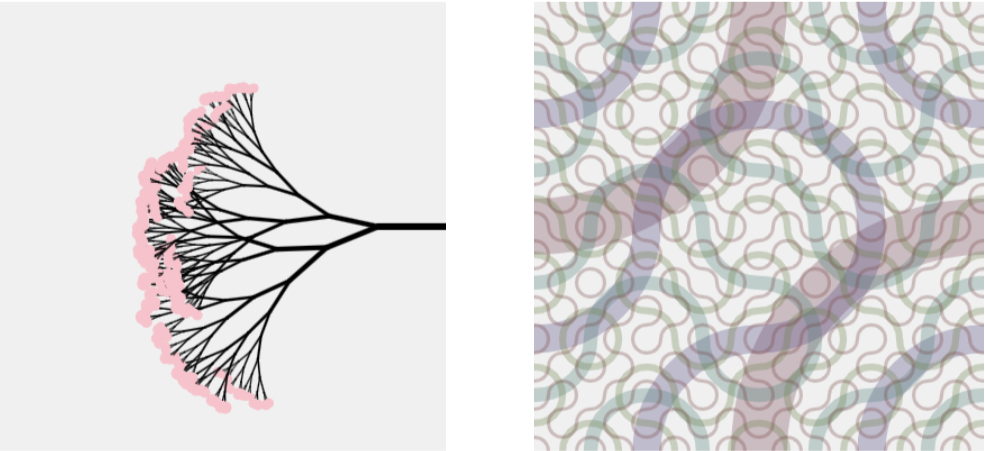

# Assignment 2: Generation
This is the coding assignment about recursive patterns by [Richard van 't Hof](https://www.therichard.space). This deliverable contains multiple experiments to illustrate the research process. Please only look at the first result for grading if you can't take multiple items into account. The other items may not always comply with the instructions. References for used inspiration or code examples can be found as comments in the source code.

## 🚀 How to run
Options:
- View `index.html` using a web server like you can find in the [VS Code Live Preview plugin](https://marketplace.visualstudio.com/items?itemName=ms-vscode.live-server).
- Open https://cc.therichard.space/recursive/

## 📄 Instructions

Create a sketch that uses [recursion](https://creative-programming.netlify.app/week2/slides/recursion/#/drawing-paxtterns-with-recursion) to generate a different complex pattern each time it is run.Your sketch will need to define a [recursive drawing function](https://creative-programming.netlify.app/week2/slides/recursion/#/drawing-patterns-with-recursion) that is called just once for the whole canvas. By its recursive nature it will call itself to complete the pattern until it reaches some base condition. (Don't forget to include a base condition!). Your sketch may want to take advantage of [transformation functions](https://creative-programming.netlify.app/week2/slides/transformations/), and [custom drawing functions](https://creative-programming.netlify.app/week2/slides/functions/#/functions), but this is not required.

- Create a sketch that uses [**recursion**](https://creative-programming.netlify.app/week2/slides/recursion/#/drawing-patterns-with-recursion) to generate a different complex pattern each time it is run.
- Your sketch will need to define a [recursive drawing function](https://creative-programming.netlify.app/week2/slides/recursion/#/drawing-patterns-with-recursion) that is called **just once** for the whole canvas.
- By its recursive nature it will call itself to complete the pattern until it reaches some base condition. (Don't forget to include a base condition!)
- Your sketch may want to take advantage of [**transformation functions**](https://creative-programming.netlify.app/week2/slides/transformations/), and [**custom drawing functions**](https://creative-programming.netlify.app/week2/slides/functions/#/functions), but this is not required.

> Do not add things to the to be graded sketches that are not in the assignment!