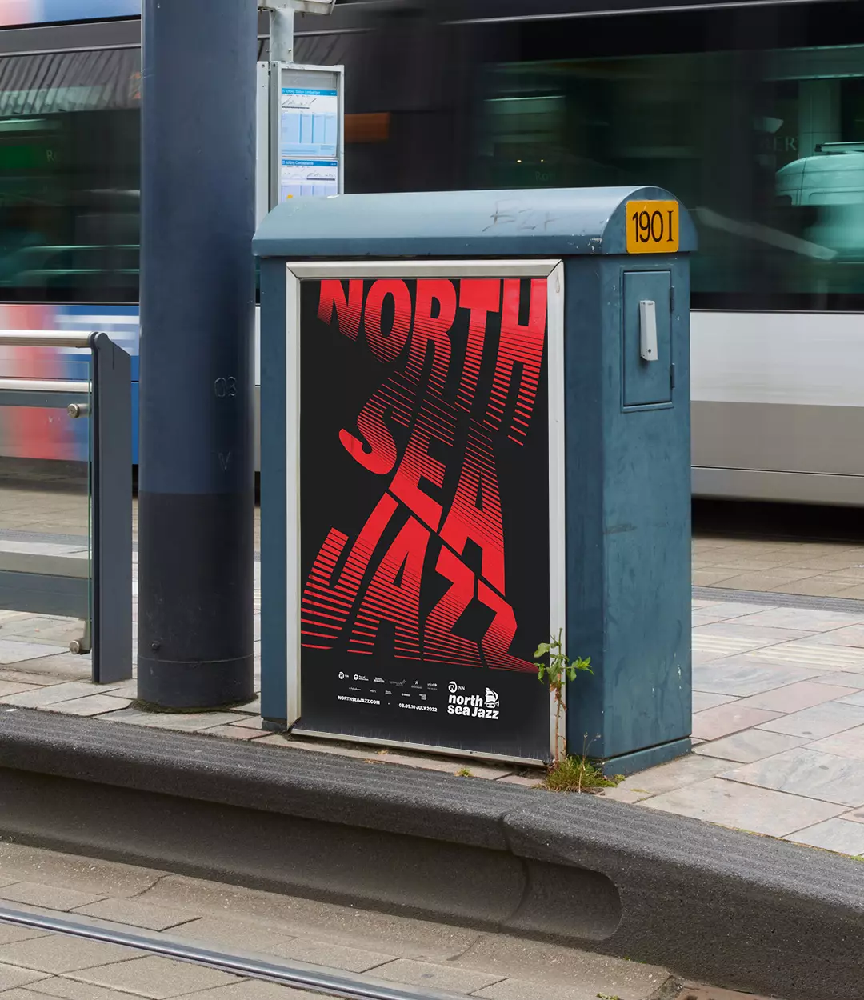
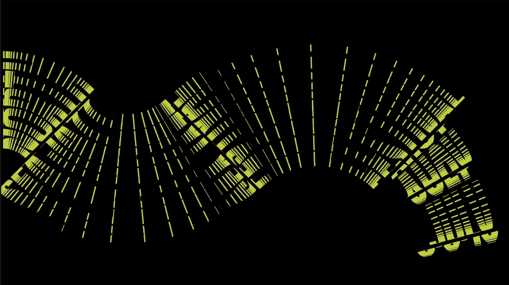
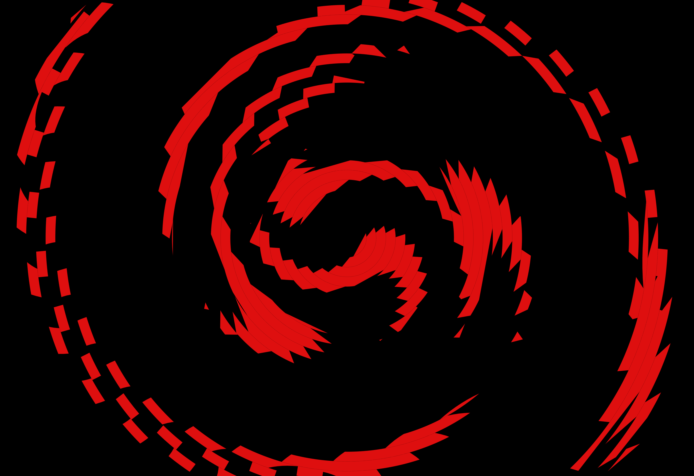

# Typographic Art tool
**By [Richard van 't Hof](https://www.therichard.space)**
*Creative Tool* assignment for Creative Progamming.
Leiden University

[toc]
## Usage instructions
1. View `index.html` using a web server like you can find in the VS Code Live Preview plugin.
1. use the panel on the right to set up your preferred page size, colours, text content and effect settings.

### Shortcuts
- `ctrl` + scroll = zoom
- `space` + drag = pan
## Project goal
I aim to develop a tool for generating both static and dynamic typographic graphics for use in graphic design, branding, and motion design projects. While such graphics can be produced using conventional design software such as Adobe Illustrator or After Effects, the process typically requires a significant amount of manual labour. This makes it time-consuming to create multiple variations with different text content or to experiment systematically with parameters and constraints within a specific visual concept. Moreover, these workflows are often unsuitable for interactive contexts, where typographic assets need to be generated dynamically in real time.

Many typographic designs, however, are based on underlying logical rules or natural patterns that can be effectively reproduced through code. Creative coding frameworks such as p5.js make it possible to translate these principles into generative systems. For this reason, design agencies such as [Studio Dumbar](https://studiodumbar.com/work/north-sea-jazz) and [Fabrique](https://www.fabrique.nl/cases/digital-design/lowlands/) frequently develop custom tools that enable designers—and sometimes their clients—to generate dynamic typographic assets on the fly.

With this project, I seek to explore whether I can develop a comparable tool myself and investigate how such a system can be used as a design instrument for creating typography in a poster or publication context.

### Functionality
I aim to add the following features and functionalities to this tool:

- One or more dynamic type designs
- Real-time preview of the graphic.
- Select the current type design concept
- Change the text
- Adjust type design parameters like text size, text colors, position and/or other parameters depending on the visual concept.
- set the export size of the graphic.
- Decide size of canvas.
- export graphic to transparent png (and ideally even svg and mp4) at print quality (300dpi).
- Pan canvas & zoom in and out
- Program must be extensible to add new styles in the future.

## Generated designs

.png)

.png)

.png)

## Reflection

For my approach to dynamic typography, I chose the *spinning record effect*, mainly inspired by the many visually compelling examples I encountered on Pinterest. Overall, the implementation went relatively smoothly, and I had a clear idea of how to structure the code from the outset. However, I ended up spending more time than expected managing the various state settings—something that is usually more streamlined in the UI frameworks I typically work with.

Another significant challenge was handling the number of p5 graphics canvases. These quickly became a major performance bottleneck, and at times it was difficult to keep track of which functions were referencing which graphic buffers. Resolving these issues took up time that I had initially hoped to dedicate to expanding the tool’s flexibility and feature set.

Despite these challenges, the tool already produces interesting and promising results. I see clear potential for further development, and extending this system in the future—both in terms of performance optimization and creative possibilities—would be a compelling next step.

## Further improvements
- More effects (should create an extensible 'TextEffect' class for this).
- Improving performance.
- Add more controls such as deciding the center of the circles
- Adding more pieces of text
- Add more font choices
